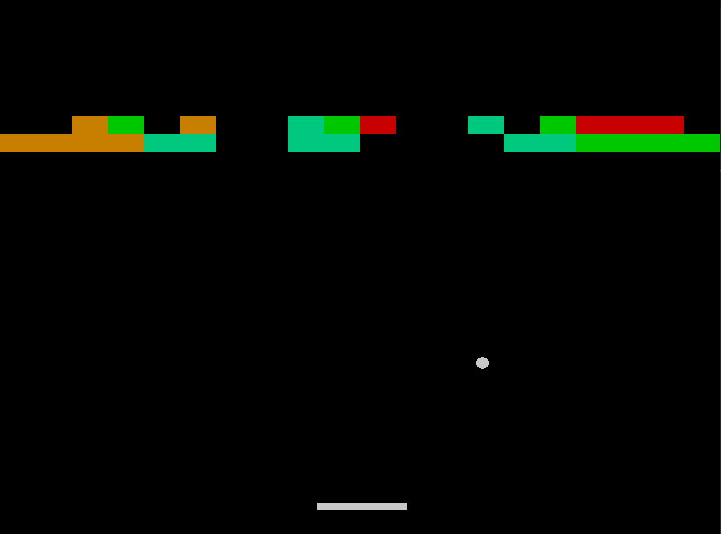

<h1 align="center">Breakout-Pygame</h1>

Esse jogo foi inspirado no famoso jogo de Arcade, o Breakout. Decidi usar a mesma lógica do jogo más mudando alguns elementos, pois queria um jogo parecido, e não igual.

## Como jogar ?
- Inicie o arquivo `main.py`.

- Ele é bem simples. Basta usar as setas do teclado: `< Esquerda` e `Direita >`

- Ao rebater a Bola, ela poderá ir para o lado oposto ou voltar pelo mesmo caminho. Sendo assim, imprevisível a próxima jogada.

- Os blocos possuem tamanho variados para cada camada, tendo assim uma variação de jogadas.

- Cada vez que a Bola bate nos cantos ou nos blocos, ela segue o lado oposto.

- A velocidade da Bola é um pouco maior do que a da Barra, obrigando o jogador a prestar o máximo de atenção em cada jogada.

- O jogador perde se a Bola cruzar o espaço vazio inferior.

- Pressione a tecla `R` para reiniciar o jogo, e a tecla `P` para pausar.

## Bugs
- A velocidade da Bola pode ser maior que a da Barra em algumas resoluções direferentes da padrão.

- A Bola pode acabar andando pelos cantos ao invés para o lado oposto.

- A Bola pode entrar em um ciclo de não colisão com os blocos, por causa da aleatoriedade da sua mudança.

- Por algum motivo o jogo não apaga todos os blocos.